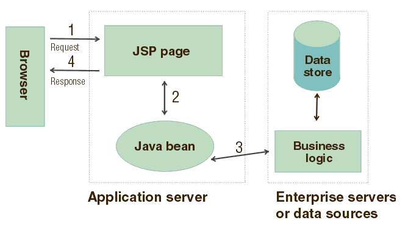

                       _oo0oo_
                      o8888888o
                      88" . "88
                      (| -_- |)
                      0\  =  /0
                    ___/`---'\___
                  .' \\|     |// '.
                 / \\|||  :  |||// \
                / _||||| -:- |||||- \
                / _||||| -:- |||||- \
               |   | \\\  -  /// |   |
               | \_|  ''\---/''  |_/ |
               \  .-\__  '-'  ___/-. /
             ___'. .'  /--.--\  `. .'___
          ."" '<  `.___\_<|>_/___.' >' "".
         | | :  `- \`.;`\ _ /`;.`/ - ` : | |
         \  \ `_.   \_ __\ /__ _/   .-` /  /
___________________________
            *****************************    
            *   NAM MÔ A DI ĐÀ PHẬT     *
            *****************************  

### Hi, my name is Hiệp, they call me Hi

## Hệ thống quản lý máy bay

@author

_______
Java

## Cấu trúc folder

+ src
    + [Model]()
    + [Service]()
    + [Handle]()
    + [Controller]()
    + [databaseTest]()

### Handle:

giao tiếp, JSP ?

### Controller:

validate requests -> trả về kết quả.

### Service:

Logic

### Model:

- Chứa các thực thể

### databaseTest:

- file DDL

### Sequence Diagram

## Tổng hợp file :

**Visual paradigm, Docs, ...**
[Link Drive](https://drive.google.com/drive/folders/1MnRWlYfC0M3rlI0FgNvf4DlWtERSRKzT?usp=sharing)
##END
để hiểu hơn về Cấu trúc thư mục :

**TestModel** ở trong folder **Models**, là 1 model bình thường.

**TestDAO** ở DAO, implement **DAO** : Create, Read, UpDate, Delete ( các câu query vào database);

**TestService** ở **Service**, Là logic : ví dụ kiểm tra testString có chứa các kí tự đặc biệt hay không, add nếu không thì add vào csdl, nếu không thì trả về lỗi.

**TestController** nhận các requests, trả về kết quả.